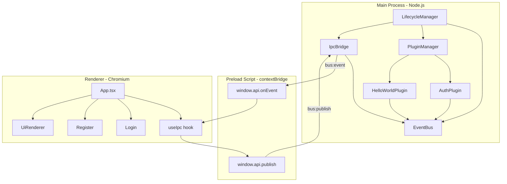
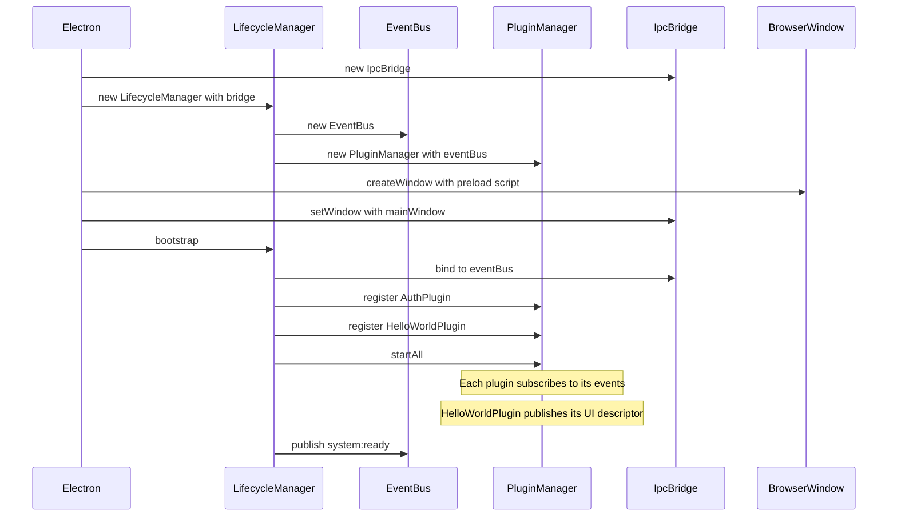
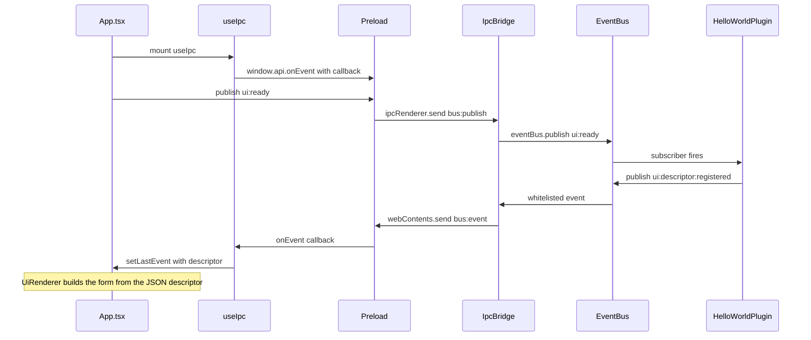
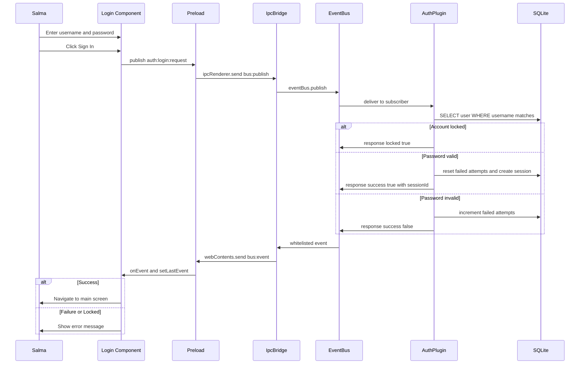
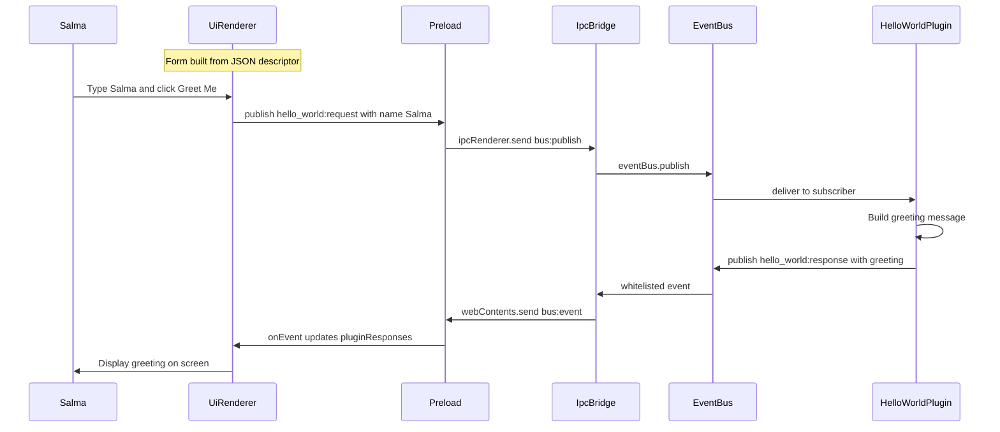
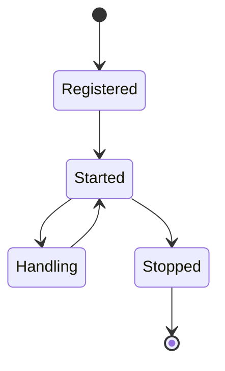
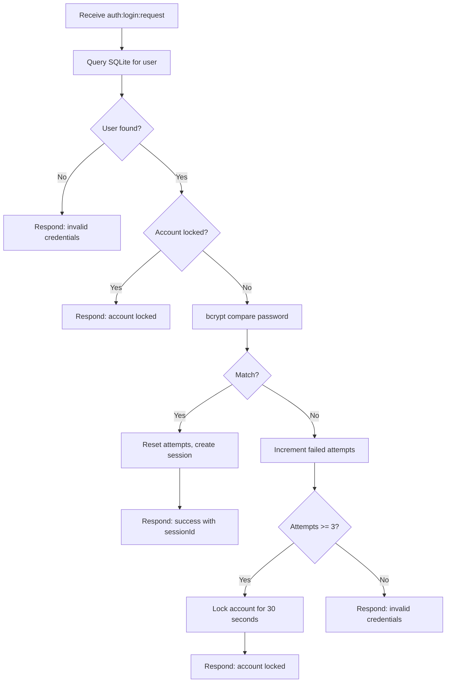
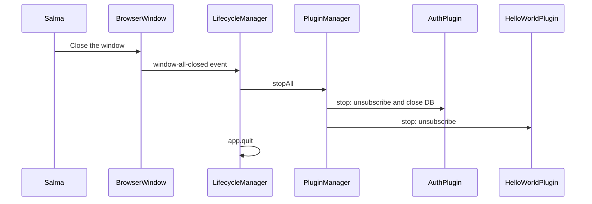
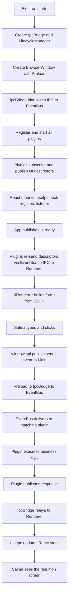

# Full Application Flow - A to Z

> From the moment Electron starts to the moment Salma sees a response.
> A new developer should understand the entire communication pattern from this page alone.

---

## Architecture Overview

### Process Boundaries

| Boundary | Left side | Right side |
|---|---|---|
| IPC Bridge | Main Process: Node.js, EventBus, Plugins | Renderer Process: Chromium, React |
| Preload Script | Electron ipcRenderer API | React window.api interface |
| EventBus | Plugin-to-plugin communication | IpcBridge forwards selected events |

---

## Phase 1 - Startup

### What happens during bind

The IpcBridge sets up two directions of communication:

1. **Renderer to Main** — `ipcMain.on('bus:publish')` receives events from React and forwards them to the EventBus.
2. **Main to Renderer** — The bridge subscribes to a whitelist of events on the EventBus and sends them to the window via `webContents.send('bus:event')`.

### Whitelisted Events

| Event | Direction | Purpose |
|---|---|---|
| ui:descriptor:registered | Main to Renderer | Plugin declares its UI form |
| hello_world:response | Main to Renderer | Greeting result |
| auth:login:response | Main to Renderer | Login success or failure or locked |
| auth:register:response | Main to Renderer | Registration result |

All other events stay inside the Main Process.

---

## Phase 2 - UI Initialization

---

## Phase 3 - Login Flow

---

## Phase 4 - Plugin Interaction

This shows how any plugin receives a command and returns a result.

---

## Phase 5 - Plugin Lifecycle

Every plugin follows the same four-step lifecycle:

| Step | What happens |
|---|---|
| Register | Plugin instance stored in PluginManager by id |
| Start | Plugin subscribes to event types on the EventBus. Optionally publishes a UI descriptor. |
| Handle | EventBus delivers matching event. Plugin reads payload, runs logic, publishes response. |
| Stop | Plugin calls all unsubscribe functions and releases resources like closing the database. |

### AuthPlugin Login Handling

---

## Phase 6 - Shutdown

---

## Complete Journey

---

## Source File Reference

| File | Role | Phase |
|---|---|---|
| src/main/index.ts | Electron entry point, creates window, bootstraps | Startup |
| src/main/core/LifecycleManager.ts | Wires EventBus + PluginManager + IpcBridge | Startup, Shutdown |
| src/main/core/EventBus.ts | Pub/sub hub: subscribe and publish | All phases |
| src/main/core/PluginManager.ts | Registers, starts, and stops plugins | Startup, Shutdown |
| src/main/core/IpcBridge.ts | Connects EventBus to Renderer via ipcMain | IPC |
| src/preload/index.ts | Exposes window.api.publish and window.api.onEvent | IPC |
| src/renderer/src/App.tsx | React root: routing, descriptor state, events | UI Init, Interaction |
| src/renderer/src/hooks/useIpc.ts | React hook wrapping IPC listener and publisher | UI Init, Interaction |
| src/renderer/src/components/UiRenderer.tsx | Builds forms from JSON descriptors | Interaction |
| src/renderer/src/components/Login.tsx | Login screen | Login Flow |
| src/renderer/src/components/Register.tsx | Registration screen | Login Flow |
| src/main/plugins/AuthPlugin.ts | Authentication, sessions, lockout | Login Flow |
| src/main/plugins/HelloWorldPlugin.ts | Proof-of-concept greeting plugin | Interaction |
| src/shared/types.ts | AppEvent, PluginInterface, UiDescriptor | All phases |
| src/shared/events.ts | Event type constants | All phases |
