# Pilot Checklist

> Living document tracking the nine pilot user stories.
> Written for the product owner.
>
> **Legend:** Done / To Do

---

## Progress

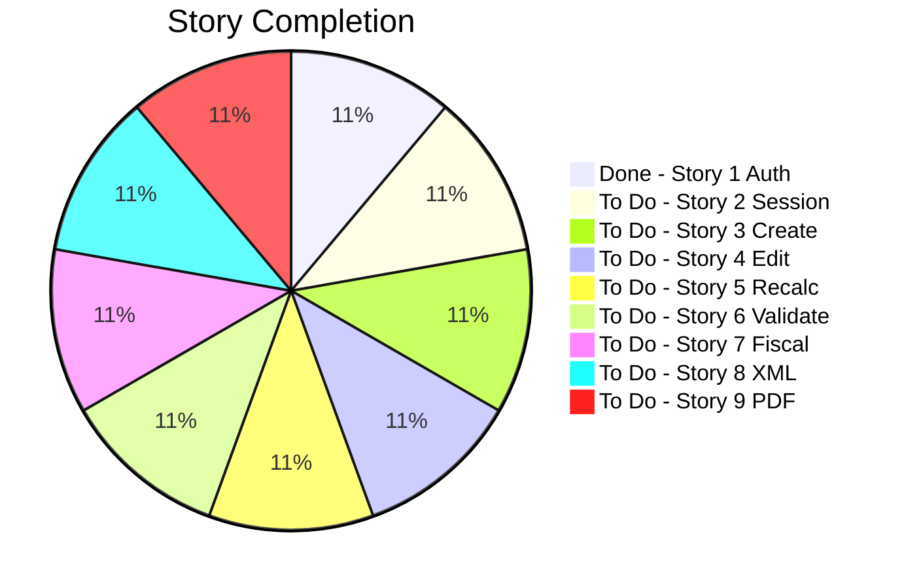

## Story Dependencies

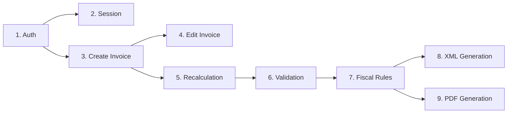

---

## Story 1 - Authentication (DONE)

> Salma can log in securely with a username and password.

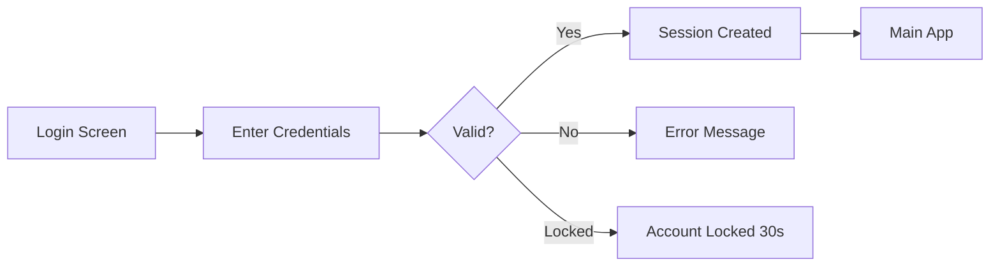

| # | Task | Status |
|---|---|:---:|
| 1.1 | Login screen with username and password fields | Done |
| 1.2 | Backend checks password against the database | Done |
| 1.3 | Clear error message when password is wrong | Done |
| 1.4 | Account locks after 3 failed attempts, 30s cooldown | Done |
| 1.5 | Registration screen for new users | Done |
| 1.6 | Reject duplicate usernames on registration | Done |
| 1.7 | Session persists so Salma is not re-prompted immediately | Done |

---

## Story 2 - Session Timeout

> Salma's session locks automatically after 15 minutes of inactivity.

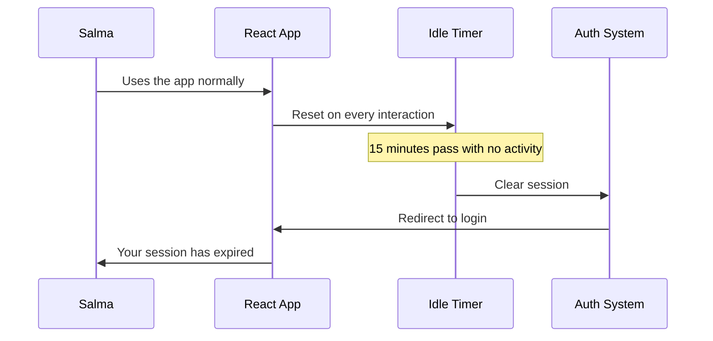

| # | Task | Status |
|---|---|:---:|
| 2.1 | Start an idle timer when Salma stops interacting | To Do |
| 2.2 | After 15 min, return to the login screen automatically | To Do |
| 2.3 | Clear the session so she must re-enter her password | To Do |
| 2.4 | Reset the timer on any click, keystroke, or mouse move | To Do |

---

## Story 3 - Invoice Creation

> Salma can manually create an invoice with all required fields.

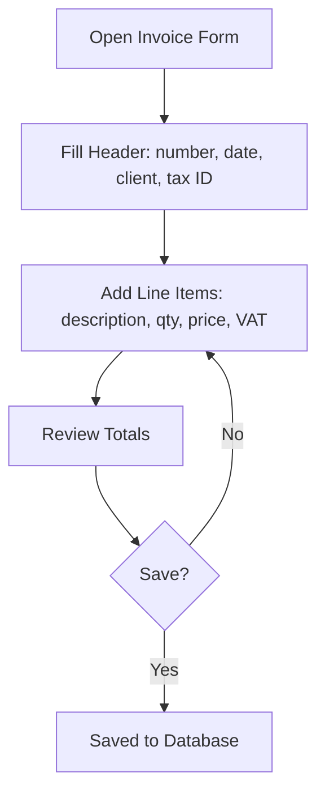

| # | Task | Status |
|---|---|:---:|
| 3.1 | Invoice form: number, date, client name, client tax ID | To Do |
| 3.2 | Add one or more line items: description, quantity, price | To Do |
| 3.3 | Select a VAT rate per line | To Do |
| 3.4 | Save the invoice to the local database | To Do |
| 3.5 | Confirmation message after saving | To Do |

---

## Story 4 - Invoice Editing

> Salma can open and edit any invoice she has already created.

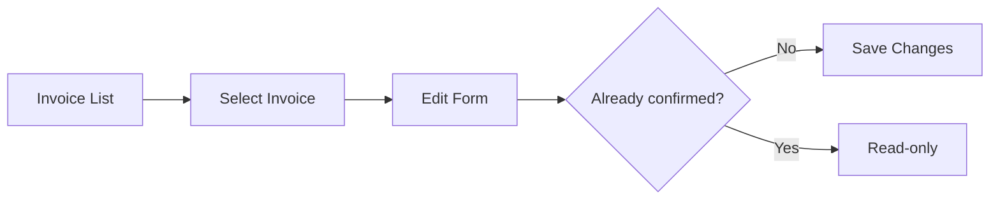

| # | Task | Status |
|---|---|:---:|
| 4.1 | List view of all saved invoices | To Do |
| 4.2 | Click an invoice to open it in the edit form | To Do |
| 4.3 | Allow changes to any field | To Do |
| 4.4 | Save updated invoice to the database | To Do |
| 4.5 | Block editing of confirmed invoices | To Do |

---

## Story 5 - Live Recalculation

> Totals update automatically whenever Salma changes a line.

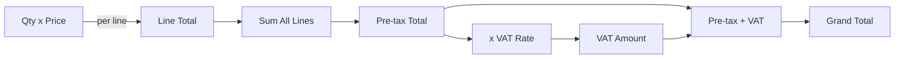

| # | Task | Status |
|---|---|:---:|
| 5.1 | Recalculate pre-tax total when quantity or price changes | To Do |
| 5.2 | Recalculate VAT amount when rate or subtotal changes | To Do |
| 5.3 | Recalculate grand total in real time | To Do |
| 5.4 | Display all three totals visibly on the form | To Do |

---

## Story 6 - Requirement Validation

> The system validates that a completed invoice meets all TEIF requirements.

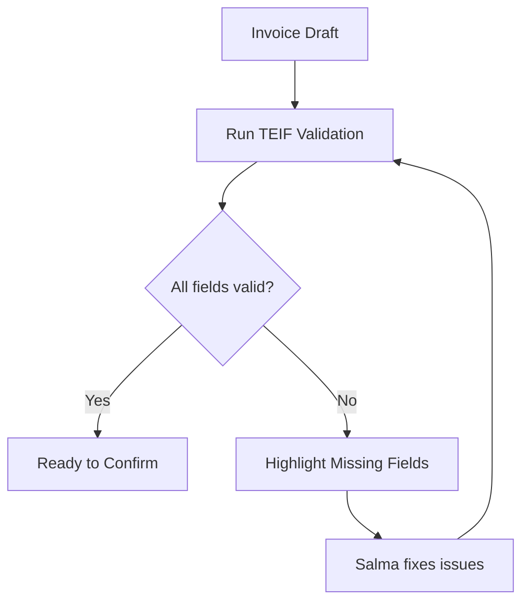

| # | Task | Status |
|---|---|:---:|
| 6.1 | Define the full list of mandatory fields per TEIF rules | To Do |
| 6.2 | Check every required field before confirmation | To Do |
| 6.3 | Highlight which fields are missing or invalid | To Do |
| 6.4 | Block confirmation until all validations pass | To Do |

---

## Story 7 - Fiscal Inconsistencies

> The system detects fiscal errors like wrong VAT rate or threshold violations.

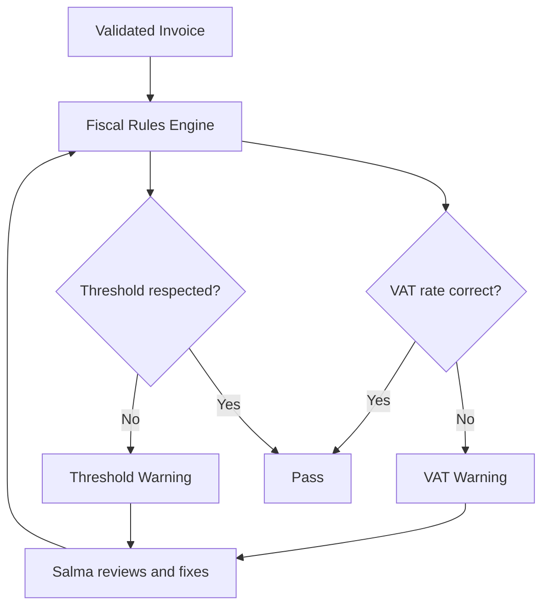

| # | Task | Status |
|---|---|:---:|
| 7.1 | Fiscal rules engine checking Tunisian tax rules | To Do |
| 7.2 | Detect mismatched VAT rates for product types | To Do |
| 7.3 | Detect invoices crossing legal thresholds | To Do |
| 7.4 | Plain-language warning listing every inconsistency | To Do |
| 7.5 | Allow Salma to fix and re-validate before confirming | To Do |

---

## Story 8 - XML Generation

> The system generates a TEIF-compliant XML and validates it against the XSD.

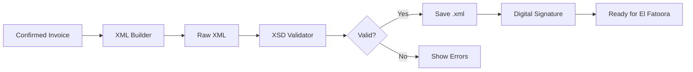

| # | Task | Status |
|---|---|:---:|
| 8.1 | XML generation mapping invoice data to TEIF structure | To Do |
| 8.2 | Validate generated XML against official XSD | To Do |
| 8.3 | Show validation result: pass or error list | To Do |
| 8.4 | Save or export the XML file | To Do |
| 8.5 | Digital signature verifiable by El Fatoora sandbox | To Do |

---

## Story 9 - PDF Generation

> The system generates a printable PDF with a QR code and legal mentions.

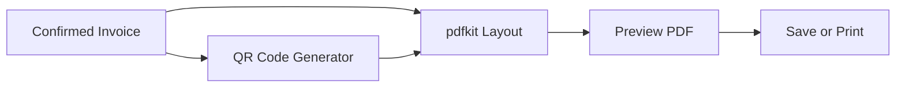

| # | Task | Status |
|---|---|:---:|
| 9.1 | PDF layout with mandatory mentions: seller, buyer, tax ID, totals | To Do |
| 9.2 | Generate QR code with verification data | To Do |
| 9.3 | Embed QR code in the PDF | To Do |
| 9.4 | Preview the PDF before saving | To Do |
| 9.5 | Save or print the PDF | To Do |

---

## Exit Criteria

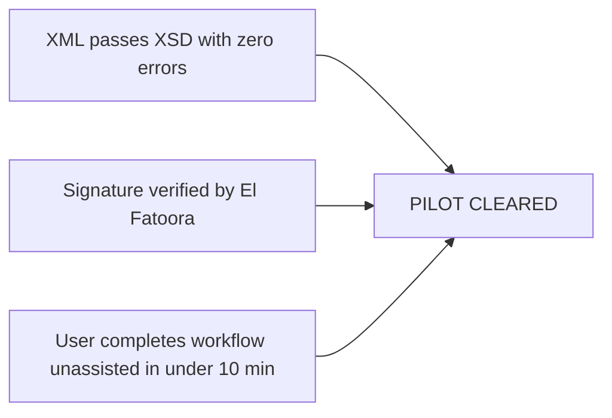

| # | Condition | Status |
|---|---|:---:|
| E1 | Generated XML accepted by TEIF XSD with zero errors | To Do |
| E2 | Signature recognized by El Fatoora in sandbox mode | To Do |
| E3 | Non-technical user completes full workflow unassisted in under 10 min | To Do |
