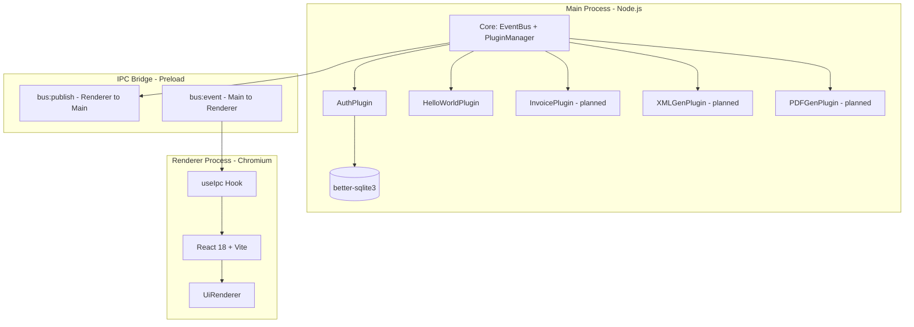
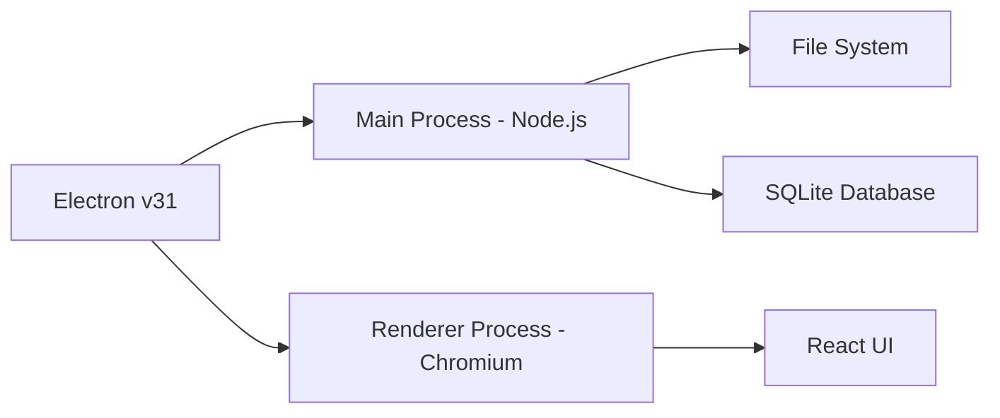
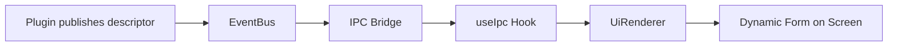
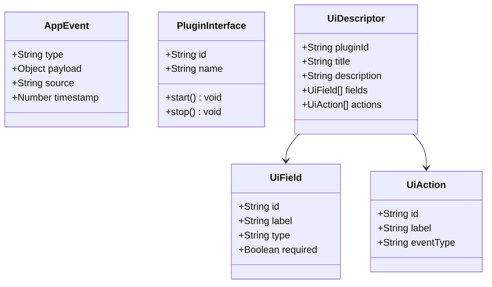
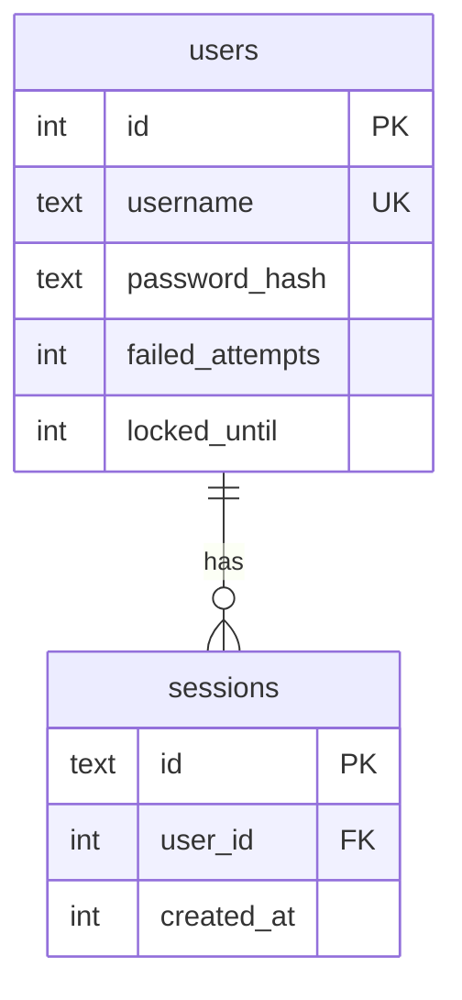
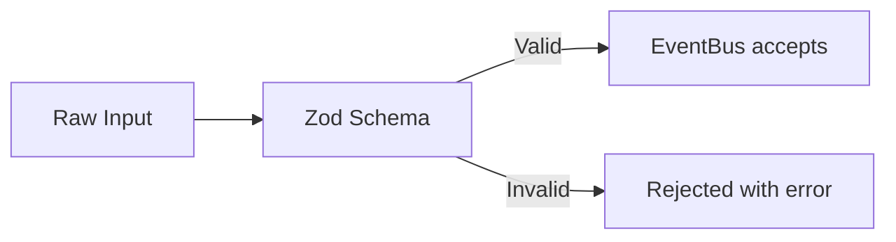
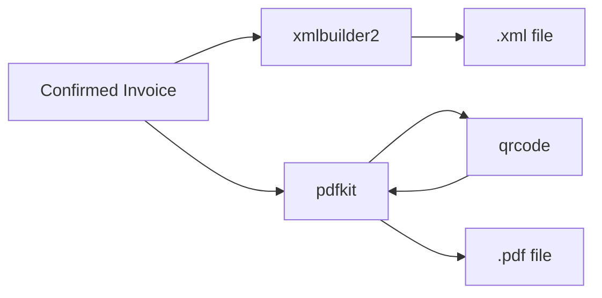
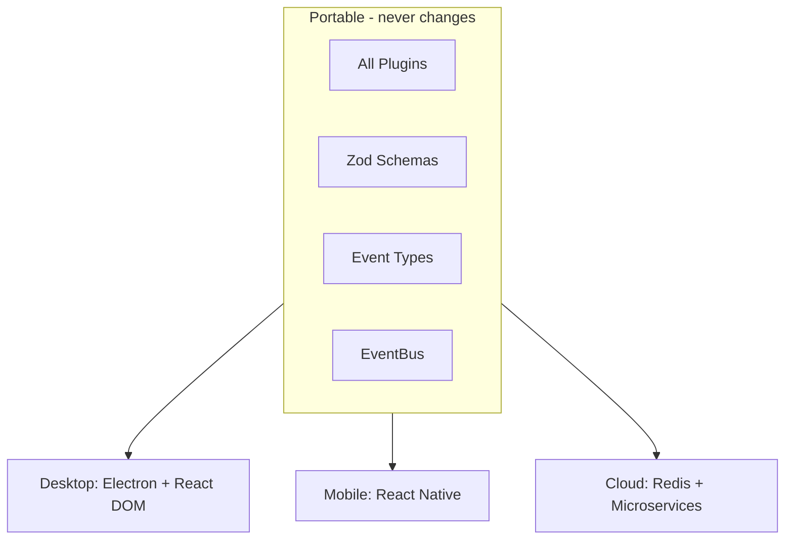

# Technology Stack

## Overview

TEIF is built on a **Microkernel architecture** running inside Electron.
Business logic lives in isolated plugins that communicate through a central event bus.
The UI is a React app that renders forms dynamically from JSON descriptors pushed by plugins.



---

## Technologies

### Electron v31

**Layer:** Platform container

Electron bundles Chromium and Node.js into a single desktop app.
The Main Process handles business logic, file I/O, and database access.
The Renderer Process displays the UI.



| Considered | Rejected because |
|---|---|
| Tauri | Requires Rust — too risky for a time-boxed pilot with a TypeScript team |
| PWA | Cannot reliably access the local file system or run offline SQLite |
| NW.js | Smaller community, no contextBridge for secure process isolation |

---

### React 18 + Vite

**Layer:** Renderer process

React renders forms and screens declaratively from JSON descriptors sent by plugins.
Vite provides sub-second hot-reload during development.



| Considered | Rejected because |
|---|---|
| Vue 3 | Smaller Electron ecosystem and fewer boilerplates |
| Svelte | JSON-to-component mapping is more natural with JSX |
| Webpack | 10-30 second rebuilds vs sub-second with Vite |

---

### TypeScript 5

**Layer:** Cross-stack (Main + Preload + Renderer + Shared)

Every event, plugin interface, and UI descriptor is typed at compile time.
A malformed event is caught before it reaches the bus.



| Considered | Rejected because |
|---|---|
| Plain JavaScript | No compile-time guarantees |
| Flow | Declining tool support and community |

---

### better-sqlite3 v11

**Layer:** Main process (Auth and data plugins)

Embedded relational database. Synchronous API, zero installation for the user, full SQL.



| Considered | Rejected because |
|---|---|
| IndexedDB | Renderer-only, no SQL, no joins |
| LowDB | No transactions, no relational integrity |
| PostgreSQL | Requires separate server installation |

---

### bcryptjs v2

**Layer:** Main process (AuthPlugin)

Hashes passwords with cost factor 12. Pure JavaScript, no native bindings.

| Considered | Rejected because |
|---|---|
| argon2 | Native C bindings add Windows build friction |
| scrypt | bcrypt is more widely audited for desktop workloads |

---

### electron-store v10

**Layer:** Main process

Stores preferences, window state, and tokens in an encrypted JSON file.

| Considered | Rejected because |
|---|---|
| dotenv | Static, no runtime persistence, no encryption |
| localStorage | Renderer-only, invisible to Main process |

---

### Zod v3

**Layer:** Cross-stack (Shared)

One schema definition produces both a runtime validator and a static TypeScript type.



| Considered | Rejected because |
|---|---|
| Joi | JavaScript-first, needs separate TS types |
| Yup | Weaker TypeScript inference |
| ajv | Verbose JSON Schema syntax |

---

### Document Generation

| Library | Purpose |
|---|---|
| xmlbuilder2 v3 | Builds XSD-compliant TEIF XML |
| pdfkit v0.15 | Generates pixel-perfect PDFs |
| qrcode v1.5 | Produces the legally mandated QR code |



---

### Build Tooling

| Tool | Purpose |
|---|---|
| electron-vite v2 | Three parallel Vite builds in one command |
| electron-builder v24 | Packages app into a Windows installer |

---

## Platform-Agnostic Strategy

All business logic lives in plugins. Plugins only communicate through the EventBus using typed JSON events. No plugin imports Electron. No plugin imports React.



The contract between infrastructure and business logic is one interface:

```typescript
interface AppEvent<T> {
  type: string        // e.g. 'invoice:create:request'
  payload: T          // validated by Zod
  source?: string     // which plugin sent it
  timestamp: number
}
```

Any transport layer that can send and receive this shape can host the plugins without rewriting a single line of business logic.
